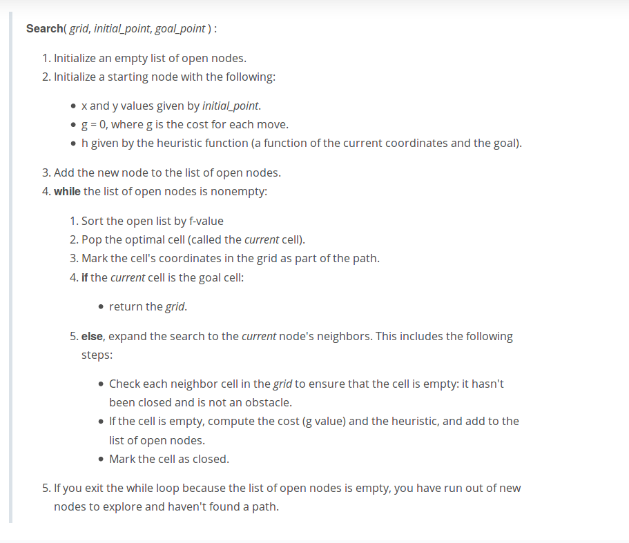

# Astar Search 
## This program uses the astar search algorithm to find the shortest path to a target.

### Astar Algorithm flow

### Run
`$ g++ -std=c++11 main.cpp`

`$ .\a.out`

### Map 
below is the map found in `board` file.

0 = way, 1 = obstacle.

starting point = {0,0}, 
goal point = {4,8}
```
0,0,1,1,0,0,1,1,0,0
0,1,0,0,0,0,0,0,0,0
0,0,0,0,0,0,0,0,0,0
0,1,1,1,1,1,1,1,1,1
0,0,0,0,0,0,0,0,0,0
```
### Output

#### All posible search
This shows all the possible search that the astar did before finding the goal point
```
🚦   🚗   ⛰️   ⛰️   0   0   ⛰️   ⛰️   0   
🚗   ⛰️   0   0   0   0   0   0   0   
🚗   🚗   🚗   🚗   🚗   🚗   🚗   🚗   🚗   
🚗   ⛰️   ⛰️   ⛰️   ⛰️   ⛰️   ⛰️   ⛰️   ⛰️   
🚗   🚗   🚗   🚗   🚗   🚗   🚗   🚗   🏁   
```

#### Final path generated
This shows the final path generated from starting point to goal point
```
🚦   0   ⛰️   ⛰️   0   0   ⛰️   ⛰️   0   
🚗   ⛰️   0   0   0   0   0   0   0   
🚗   0   0   0   0   0   0   0   0   
🚗   ⛰️   ⛰️   ⛰️   ⛰️   ⛰️   ⛰️   ⛰️   ⛰️   
🚗   🚗   🚗   🚗   🚗   🚗   🚗   🚗   🏁   
```